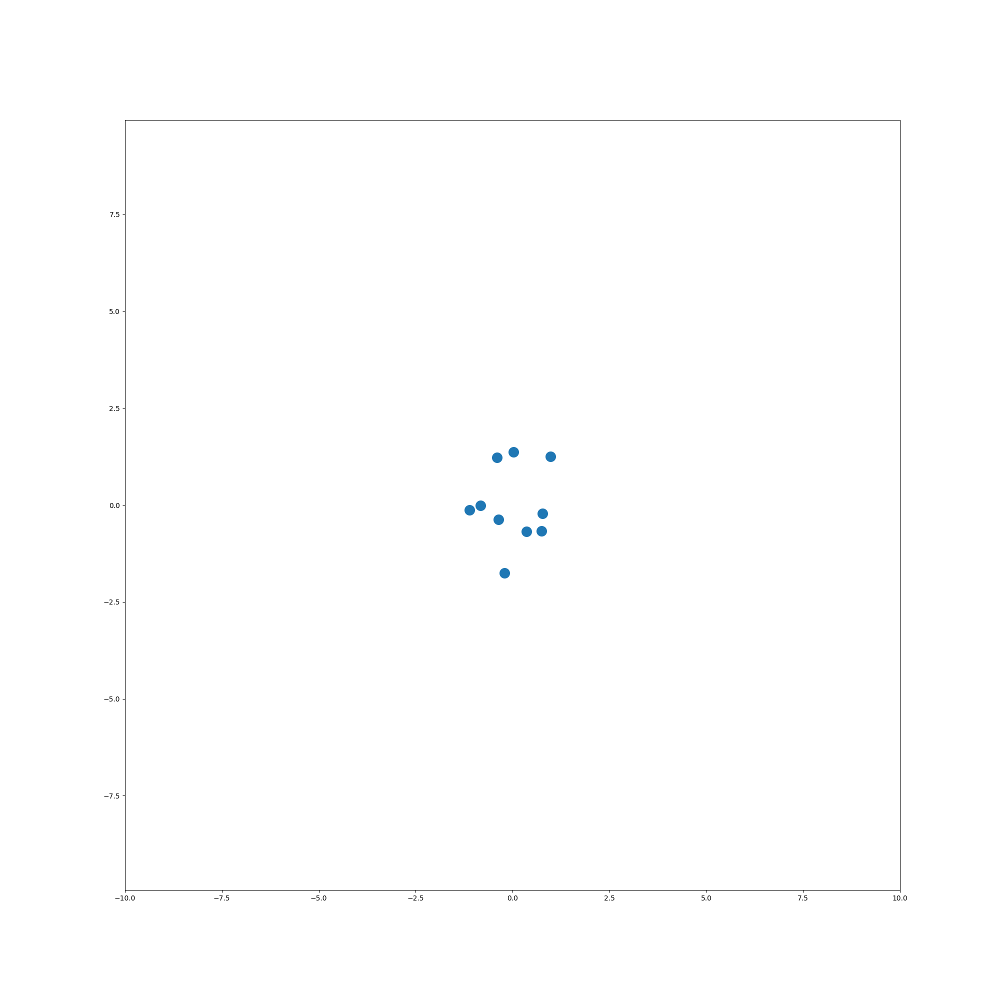

# 2D-equivariant-diffusion
Generating 2D straight lines using a generative diffusion model, composed of rotationally equivariant GNN layers.

This code is based off the paper [Equivariant Diffusion for Molecule Generation in 3D](https://arxiv.org/abs/2203.17003), and some parts of the code were written with their (amazing!) [implementation](https://github.com/ehoogeboom/e3_diffusion_for_molecules) as reference.

## Motivation

The idea of this project is to demonstrate an understandable, minimal example of an equivariant diffusion model. For this purpose, I tried to simplify the problem as much as possible:
- Created a "toy" dataset of 2D straight lines oriented along the `x` axis only (see `straight_line_dataset.py`)
- Defined an Equivariant Graph Neural Network (EGNN) composed of equivariant Graph Convolutional layers, using `pytorch_geometric` and minimal code (see `egnn.py`)

During training, the EGNN is trained on straight line examples that have various levels of noise added to them. These examples represent a "forward" diffusion process that steadily diffuses the straight lines into isotropic Gaussians in 2D.

By sampling from a 2D isotropic Gaussian and running the reverse 2D process, we should see straight lines generated. Critically, these straight lines _should not necessarily be oriented along the x axis_ due to the equivariant nature of the GNN, and the isotropic Gaussian from which the initial sample originated.

Here is one such example of the trained reverse diffusion process in action!




## Training

For the moment the code is extremly minimal - the only entrypoint is the `train` file, and this trains the diffusion model, outputting GIFs of the reverse diffusion process at different epochs as it does so.

To do this, simply run the train file:
```bash
python train.py
```

To modify parameters, see the `CONFIG` dict in this file.

I will be improving this file (adding at least `argparse`) and adding other functionality in the future.